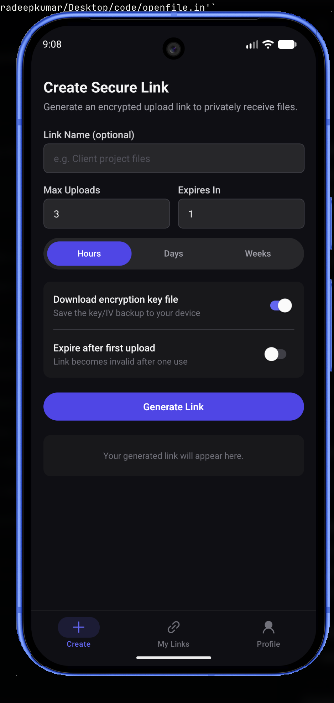
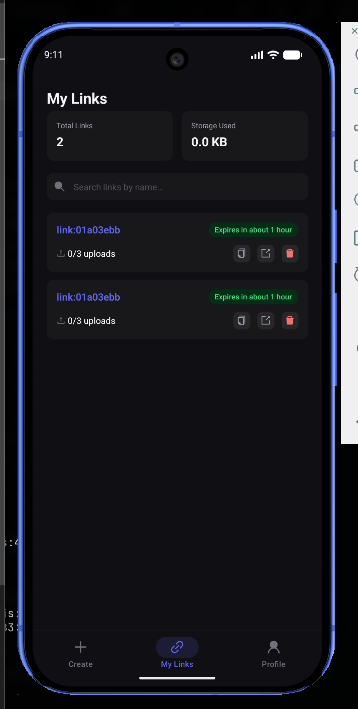
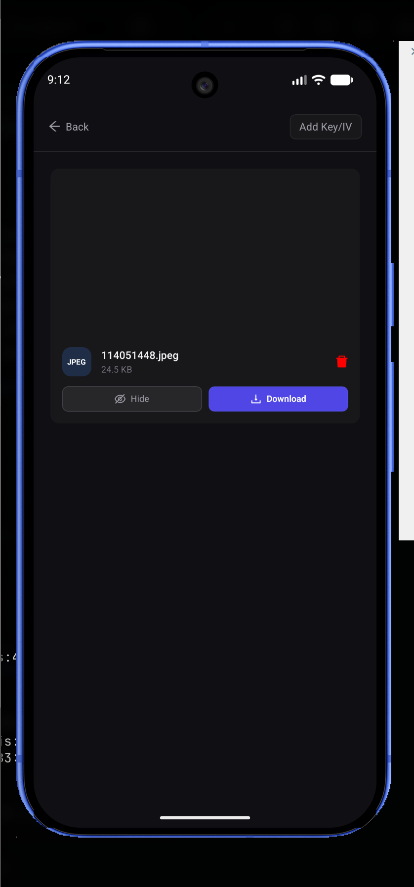

# OpenFile

OpenFile is a secure and encrypted file receiver/sharing service. Generate a link, share it with anyone, and they can send you files anonymously — right from your phone.

## Features

- Generate shareable links for anonymous file uploads
- Files encrypted before leaving the sender's device
- Fast in-app decryption (no server-side decryption)
- Token-based access for shared links
- Built with Expo, React Native, and NativeWind

## Screenshots

<p align="center">
  
  
  
</p>

## Tech Stack

- **Framework:** Expo (React Native)
- **Navigation:** Expo Router
- **Styling:** NativeWind (TailwindCSS)
- **State:** Zustand, TanStack Query
- **Encryption:** AES (aes-js + expo-crypto)

## Getting Started

```bash
# Clone the repo
git clone https://github.com/exvillager/openfile-app.git
cd openfile-app

# Install dependencies
bun install

# Start the app
bun run start
```

Run on device:

```bash
bun run android
bun run ios
```

## Security Design

- Files are encrypted on-device before upload
- The encryption key is embedded in the link hash — never sent to the server
- The server cannot decrypt user files

## Feedback / Support

- Open an issue
- Submit a pull request

## License

AGPL-3.0 License © 2025 Pradeep Sahu
